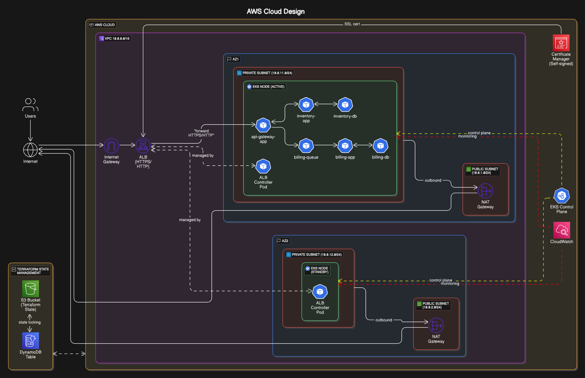

# Cloud Design Project

A cloud-native microservices architecture deployed on AWS EKS (Elastic Kubernetes Service), designed for high availability, scalability, and security.



## Project Overview

This project implements a cloud-native movie catalog service with three main components:

- **API Gateway**: Entry point for all client requests, routing traffic to appropriate services
- **Inventory Service**: Manages movie catalog with CRUD operations via RESTful API
- **Billing Service**: Processes orders through a message queue system

## Deployment Status

### Kubernetes Resources

The following image shows the running Kubernetes services and pods in the cluster:


### API Testing Results

Successful API test results from Postman showing the Movie CRUD operations working against the AWS ingress endpoint:


## Architecture Components

### Infrastructure (AWS)

- **VPC**: Custom VPC (10.0.0.0/16) spanning multiple availability zones
- **EKS Cluster**: Managed Kubernetes with nodes in private subnets
- **Multi-AZ Setup**: Resources distributed across eu-north-1a and eu-north-1b for high availability
- **Load Balancing**: Application Load Balancer with HTTPS support
- **Security**: Private/public subnet separation with proper gateway configuration
- **Monitoring**: CloudWatch integration for monitoring and alerting
- **State Management**: Terraform state in S3 with DynamoDB locking

### Microservices

1. **API Gateway**

   - Entry point for all client requests
   - Routes requests to appropriate backend services
   - Swagger/OpenAPI documentation at `/api-docs`
   - Built with Node.js/Express

2. **Inventory Service**

   - Movie catalog management (CRUD operations)
   - PostgreSQL database for persistent storage
   - RESTful API endpoints

3. **Billing Service**
   - Order processing via message queue
   - PostgreSQL database for order history
   - Asynchronous processing using RabbitMQ

## Technologies

- **Container Orchestration**: Kubernetes via Amazon EKS
- **Infrastructure as Code**: Terraform modules for AWS resource provisioning
- **CI/CD**: Scripts for building, testing, and deploying services
- **Databases**: PostgreSQL for persistent storage
- **Messaging**: RabbitMQ for asynchronous communication
- **API Documentation**: OpenAPI/Swagger
- **Languages & Frameworks**: Node.js, Express
- **Container Registry**: Docker Hub

## Project Structure

```
cloud-design/
├── docker-compose.yaml         # Local development setup
├── kustomization.yaml          # Kubernetes resource management
├── Dockerfiles/                # Docker build configurations
├── images/                     # Architecture diagrams
├── manifests/                  # Kubernetes manifests
│   ├── api-gateway-app.yaml
│   ├── billing-app.yaml
│   ├── billing-db.yaml
│   ├── billing-queue.yaml
│   ├── inventory-app.yaml
│   ├── inventory-db.yaml
│   └── networking/
│       └── api-gateway-ingress.tpl.yaml
├── postman/                    # API test collections
├── scripts/                    # Utility scripts
│   ├── apply-ingress.sh
│   ├── build-and-push.sh
│   ├── cleanup-k8s-resources.sh
│   ├── configure-kubectl-helm.sh
│   ├── init-billing-db.sh
│   └── init-inventory-db.sh
├── src/                        # Application source code
│   ├── api-gateway/            # API Gateway service
│   ├── billing-app/            # Billing service
│   └── inventory-app/          # Inventory service
└── terraform/                  # Infrastructure as code
    ├── acm/                    # Certificate management
    ├── bootstrap/              # Terraform state setup
    ├── cloudwatch/             # Monitoring
    ├── eks/                    # Kubernetes cluster
    ├── iam/                    # Identity & access
    ├── kubernetes-addons/      # K8s addons (ALB, metrics)
    └── vpc/                    # Network configuration
```

## Getting Started

### Prerequisites

- AWS CLI configured with appropriate permissions
- Terraform v1.11.4+
- Docker and Docker Compose
- kubectl
- Helm v3

### Required AWS Permissions

Before beginning the deployment, ensure your AWS user has the following IAM permissions:

```json
{
  "Version": "2012-10-17",
  "Statement": [
    {
      "Sid": "TerraformIAMBootstrap",
      "Effect": "Allow",
      "Action": [
        "iam:GetUser",
        "iam:CreatePolicy",
        "iam:GetPolicy",
        "iam:GetPolicyVersion",
        "iam:AttachUserPolicy",
        "iam:ListAttachedUserPolicies",
        "iam:ListPolicyVersions",
        "iam:DetachUserPolicy",
        "iam:DeletePolicy",
        "iam:DeletePolicyVersion",
        "iam:CreatePolicyVersion",
        "iam:UpdateAssumeRolePolicy"
      ],
      "Resource": "*"
    }
  ]
}
```

You can create this policy in the AWS Management Console or see the `bootstrap/initial-user-policy.json` file for a ready-to-use policy document.

### Setup Infrastructure

1. **Initialize Terraform state backend**:

   ```bash
   cd terraform/bootstrap
   terraform init
   terraform apply
   ```

2. **Deploy main infrastructure**:

   ```bash
   cd ..
   terraform init
   terraform apply
   ```

3. **Configure kubectl and Helm**:

   ```bash
   cd ..
   ./scripts/configure-kubectl-helm.sh
   ```

4. **Deploy application**:
   ```bash
   kubectl apply -k .
   ```

### Local Development

For local development using Docker Compose:

```bash
cp .env.example .env
# Edit .env file with appropriate values
docker-compose up
```

## API Documentation

When running, API documentation is available at `/api-docs` endpoint of the API Gateway service.

## Testing with Postman

Import the collections and environment from the `postman/` directory to test the API:

1. Import `cloud-design.postman_collection.json`
2. Import `cloud_design.postman_environment.json`
3. Update the environment variables with your deployment details

## Cleanup

To clean up resources:

1. **Remove application resources**:

   ```bash
   ./scripts/cleanup-k8s-resources.sh
   ```

2. **Destroy infrastructure**:
   ```bash
   cd terraform
   terraform destroy
   cd bootstrap
   terraform destroy
   ```

## Architecture Features

- **High Availability**: Multi-AZ deployment with automatic failover
- **Scalability**: EKS auto-scaling with configurable node groups
- **Security**: Private subnets for application pods, public-only for ingress
- **Observability**: CloudWatch integration for monitoring and alerting
- **Disaster Recovery**: AZ2 configured for disaster recovery and scaling
- **HTTPS Support**: Integrated with AWS Certificate Manager using a self-signed certificate (a proper ACM certificate would be used with a registered domain name)

## License

See the [LICENSE](./LICENSE) file for licensing details.
